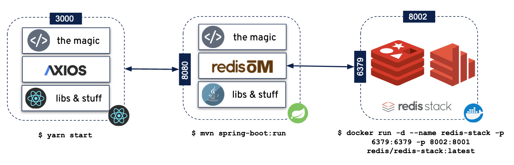

# Redis Movies 

    This project contains multiple resources to explore and use Redis Search + Redis JSON

High level arch: 

## Projects 

---
**NOTE**: Startup Procedure Required:
1. Start Redis-Stack `$ docker start redis-stack`
2. Start the Java Service `$ mvn spring-boot:run`
3. Start the frontend `$ yarn start`
4. ✨  Done
----

1. Redis Stack : https://redis.io/docs/stack/
2. Spring-Redis Java Movies Service ---> [Java Service](./spring-redis-search-om-api)
3. React Frontend Movies ---> [React Movies Site](./website)

### Software Reqs 

 - Docker 
 - Java 11+ 
 - NPM 8+
 - Node v18.7.0
 - Yarn 1.22.17+

### React Preview 

